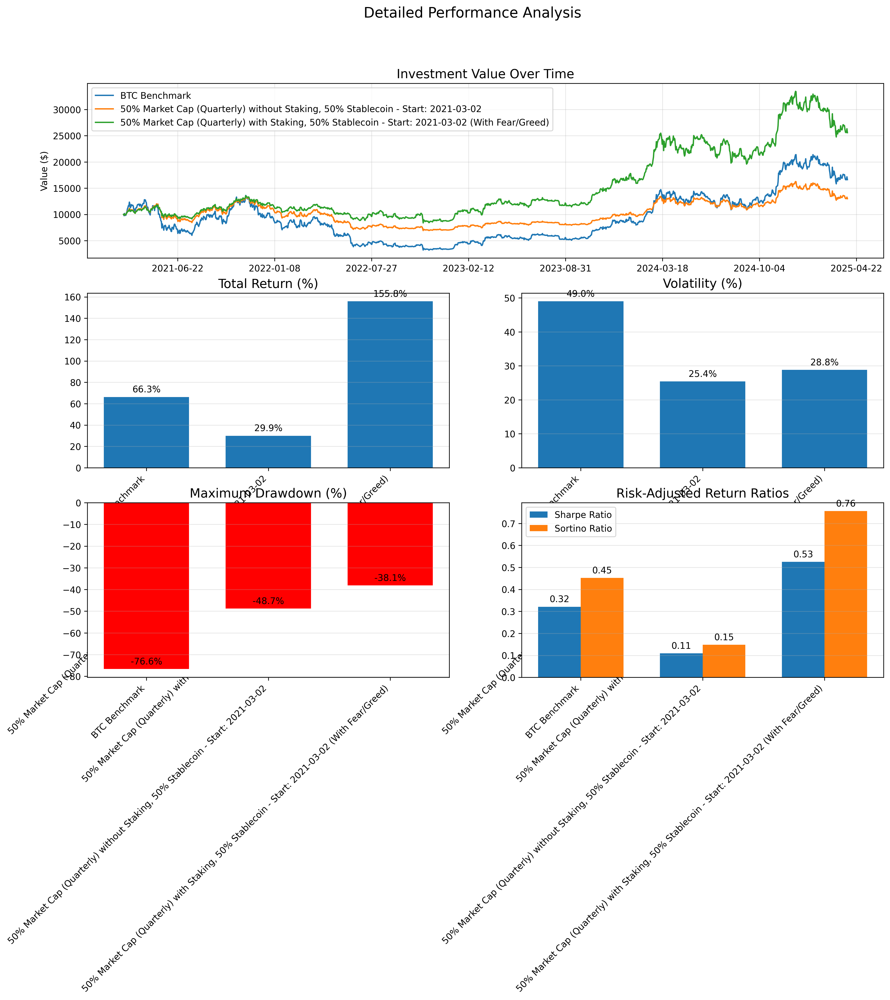

# Index500

A web3 index fund

## Installation

1. poetry install
2. yarn

## Run

`python main.py --start-date=2021-03-02 --fear-greed-file=./dataset/fear_and_greed.json --stablecoin-allocation=0.5`

## Performance

